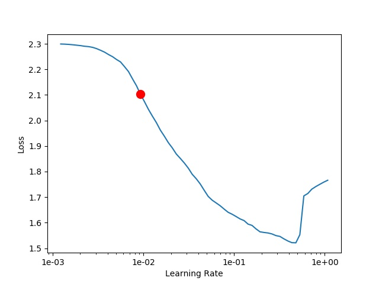

# Deep Learning Template in PyTorch

## Features
1. Easy distributed training.
```bash
trainer=Trainer(...)
trainer.to_distributed()
trainer.fit()
```
2. Easy distributed inference.
```bash
trainer=Trainer(...)
trainer.to_distributed()
trainer.get_preds()
```
3. Learning-rate finder helps you find best learning rate.
```bash
trainer=Trainer(...)
trainer.find_lr()
```



### Install

1. install PyTorch according to https://pytorch.org/
2. pip install -r requirements.txt
3. sh build_and_install.sh

## Training and inference example for MNIST 
1. Find learning-rate.
```bash
CUDA_VISIBLE_DEVICES=0 python train_net.py --config-file configs/mnist/defaults.yaml --mode findlr
```

2. Training.
```bash
# single gpu
CUDA_VISIBLE_DEVICES=0 python train_net.py --config-file configs/mnist/defaults.yaml
```
```bash
# multi-gpu distributed training.
CUDA_VISIBLE_DEVICES=0,1,2,3 python -m torch.distributed.launch --nproc_per_node 4 train_net.py --config-file configs/mnist/defaults.yaml
```
2. Inference and evaluation.
```bash
# single gpu
CUDA_VISIBLE_DEVICES=0 python train_net.py --config-file configs/mnist/defaults.yaml --mode eval
```
```bash
# multi-gpu distributed inference.
CUDA_VISIBLE_DEVICES=0,1,2,3 python -m torch.distributed.launch --nproc_per_node 4 train_net.py --config-file configs/mnist/defaults.yaml --mode eval
```

## Extend by your own dataset.


## Citations
This project is inspired by maskrcnn-benchmark.
```
@misc{massa2018mrcnn,
author = {Massa, Francisco and Girshick, Ross},
title = {{maskrcnn-benchmark: Fast, modular reference implementation of Instance Segmentation and Object Detection algorithms in PyTorch}},
year = {2018},
howpublished = {\url{https://github.com/facebookresearch/maskrcnn-benchmark}},
note = {Accessed: [Insert date here]}
}
```